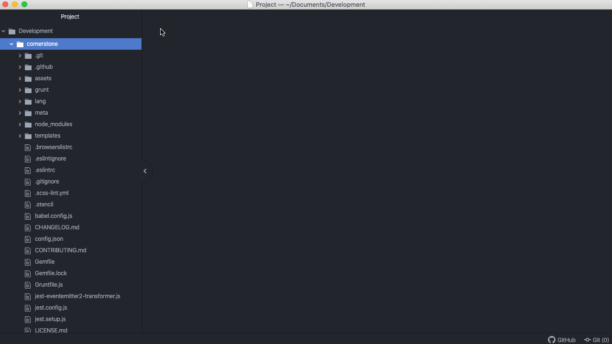
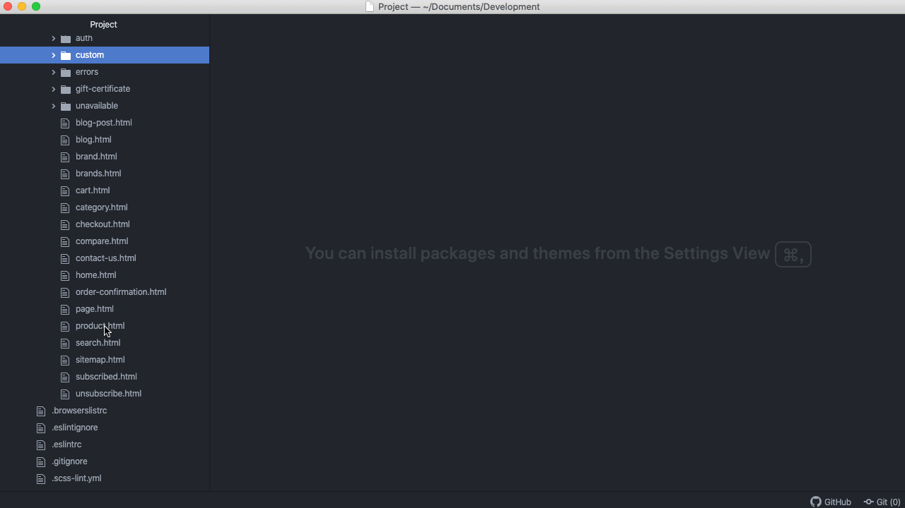
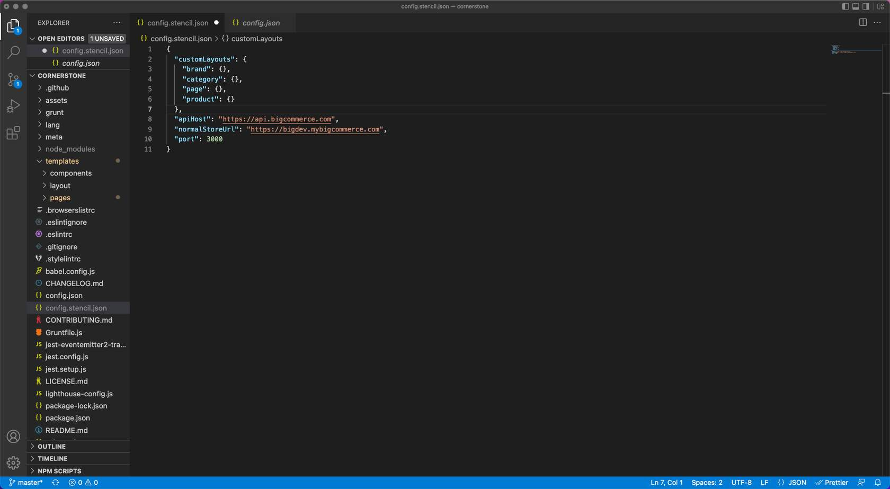
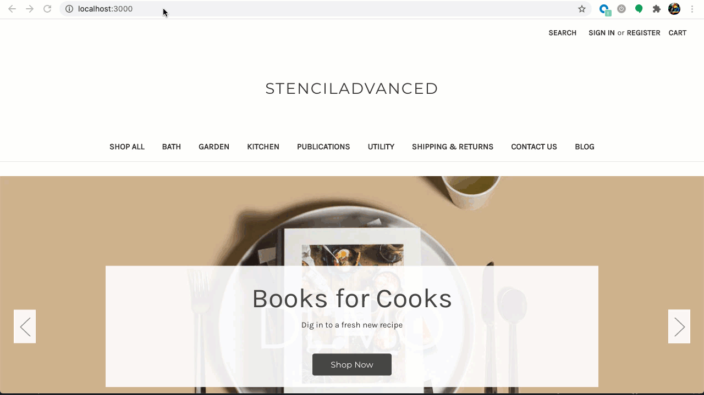
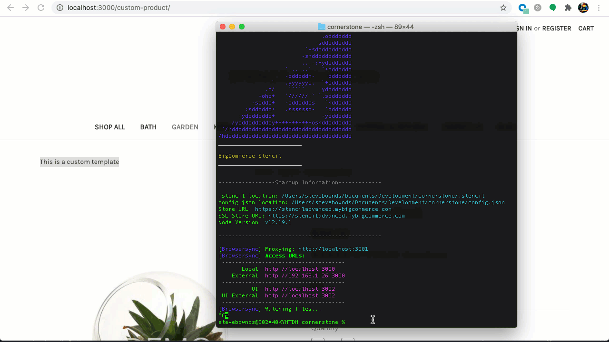

# Lab Activity: Create a Custom Template

**Prerequisites**

* Stencil CLI Installed
* Cornerstone theme cloned

## Create the _custom_ Subdirectory in the templates/pages Directory

1. **Navigate** to _templates/pages_ within your cornerstone theme files
2. **Create** a new folder under _templates/pages_ called _custom_
3. **Create** a new folder under_templates/pages/custom_called _product_



## Create the Template HTML File

1. **Edit** the _product.html_ file
2. **Customize** the file (for this example we are just adding text for demonstration)
3. **Save** the modified html file as a new file named as an existing product URL in your store (for this example we are using _custom-product.html)_
4. **Ensure** the new html file is saved to the _templates/pages/custom/product_ directory



## Map the Template to a URL in the config.stencil.json File

1. **Navigate** to the _config.stencil.json_ file
2. **Add** the code below to the _"customLayouts"_ section
3. **Enter** _stencil start_ on the command line

```json showLineNumbers={false}
"product": {
    	"custom-product.html":"/custom-product/"
}
```



## Test Your Custom Template Locally

1. **Navigate** to _http://localhost:3000/custom-product/_



## Apply Theme & Assign Custom Template

**Bundle** and **Push** the theme to your BigCommerce Store <br />
*Alternatively you can use a stencil bundle to create a zip file to manually upload.

1. **Enter** the following command in CLI: _stencil push_
2. **Enter** _y_ to apply the theme to your store
3. **Select** the theme variation you would like to apply

**Assign** the custom template to the page

1. **Navigate** to the store control panel
2. **Go** to _Products > View_ and edit the product that will use the custom template
3. **Click** Storefront Settings
4. **Select** the custom template from the _Template Layout File_ dropdown
5. **Click** Save
6. **View** the product in the store



