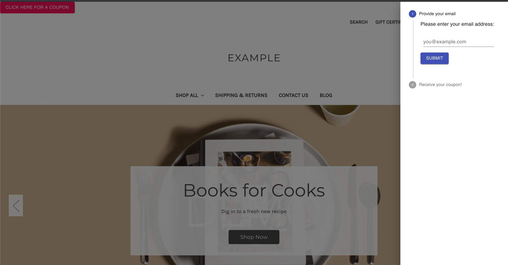

# Lab Activity: Add React Components with NPM

In this lab activity, we'll be making a drawer that sends a coupon code to the customer's email using Material UI's React framework.

**Prerequisites**

* Stencil CLI installed
* BigCommerce store
* Cornerstone Stencil theme with npm installed
* Knowledge of HTML and JavaScript

## Adding npm Packages to a Theme

Stencil's architecture allows for organized customization using npm and React. In production, you can use these tools for stylizing seasonally themed products, temporary promotions, or event tickets. Below is a short tutorial on using npm and React to customize your Stencil theme.

The resulting customization will look like the following:




You should have most of the following already setup. Use the steps to verify as you go through this activity.

## Installing React to npm packages

To build this customization, complete the instructions in the following sections.

### Install dependencies

For this activity, we'll be using packages from [MUI Core](https://material-ui.com/). These components require certain modules.

Navigate into the root Cornerstone theme folder, then install the following npm packages.

```bash showLineNumbers={false}
# navigate into theme dir
cd ~/path/to/theme/dir

# install dependencies
npm install --save-dev @material-ui/core react react-dom babel-plugin-transform-object-assign @babel/preset-react
```

### Update webpack.common.js

Update _webpack.common_.js with the new presets and plugins.

```js showLineNumbers={false}
...
plugins: [
  ...
   'transform-object-assign',
 ],
```

```js showLineNumbers={false}
...
presets: [
    ['@babel/preset-env', {
        ...
    }], '@babel/react',
  ],
```

### Create components

In the following steps, we'll be adding React components to assemble our coupon drawer.

1. **Navigate** to the _./assets/js_ folder
2. **Create** a _/components_ folder within the _/js_ folder
3. **Navigate** into the _/components_ folder
4. **Create** a _CouponDrawer.js_ file
5. **Copy** the following code into the file:


```js showLineNumbers={false}
import React from 'react';
import { makeStyles } from '@material-ui/core/styles';
import Drawer from '@material-ui/core/Drawer';
import Button from '@material-ui/core/Button';
import List from '@material-ui/core/List';
import Divider from '@material-ui/core/Divider';
import ListItem from '@material-ui/core/ListItem';
import ListItemText from '@material-ui/core/ListItemText';
import VerticalStepper from './VerticalStepper';

export default function CouponDrawer() {
  const [state, setState] = React.useState({
    right: false,
  });

  const toggleDrawer = (side, open) => event => {
    if (event.type === 'keydown' && (event.key === 'Tab' || event.key === 'Shift')) {
      return;
    }

    setState({ ...state, [side]: open });
  };

  return (
    <div>
      <Button color="secondary" variant="contained" onClick={toggleDrawer('right', true)}>Click Here For A Coupon</Button>
      <Drawer anchor="right" open={state.right} onClose={toggleDrawer('right', false)}>
        <VerticalStepper />
      </Drawer>
    </div>
  );
}
```

6. In the same _/components_ folder, **create** a _VerticalStepper.js_ file
7. **Copy** the following code into the file:


```js showLineNumbers={false}
import React from 'react';
import { makeStyles } from '@material-ui/core/styles';
import Stepper from '@material-ui/core/Stepper';
import Step from '@material-ui/core/Step';
import StepLabel from '@material-ui/core/StepLabel';
import StepContent from '@material-ui/core/StepContent';
import Button from '@material-ui/core/Button';
import Typography from '@material-ui/core/Typography';
import TextField from './TextField';

const useStyles = makeStyles(theme => ({
  root: {
    width: '100%',
  },
  button: {
    marginTop: theme.spacing(1),
    marginRight: theme.spacing(1),
  },
  actionsContainer: {
    marginBottom: theme.spacing(2),
  },
  resetContainer: {
    padding: theme.spacing(3),
  },
}));

function getSteps() {
  return ['Provide your email', 'Receive your coupon!'];
}

function getStepContent(step) {
  switch (step) {
    case 0:
      return `Please enter your email address:`;
    case 1:
      return `We have sent a coupon code to your email address.`;
    default:
      return `Unknown step`;
  }
}

export default function VerticalLinearStepper() {
  const classes = useStyles();
  const [activeStep, setActiveStep] = React.useState(0);
  const steps = getSteps();

  const handleNext = () => {
    setActiveStep(prevActiveStep => prevActiveStep + 1);
  };

  return (
    <div className={classes.root}>
      <Stepper activeStep={activeStep} orientation="vertical">
        {steps.map((label, index) => (
          <Step key={label}>
            <StepLabel>{label}</StepLabel>
            <StepContent>
              <Typography>{getStepContent(index)}</Typography>
              {activeStep === 0 ? <TextField /> : null}
              <div className={classes.actionsContainer}>
                {activeStep === 0 && (
                  <div>
                    <Button
                      variant="contained"
                      color="primary"
                      onClick={handleNext}
                      className={classes.button}
                    >
                      Submit
                    </Button>
                  </div>
                )}
              </div>
            </StepContent>
          </Step>
        ))}
      </Stepper>
    </div>
  );
}
```

8. In the same _/components_ folder, **create** a _TextField.js_ file
9. **Copy** the following code into the file:


```js showLineNumbers={false}
import React from 'react';
import { makeStyles } from '@material-ui/core/styles';
import TextField from '@material-ui/core/TextField';

const useStyles = makeStyles(theme => ({
  root: {
    '& > *': {
      margin: theme.spacing(1),
      width: 200,
    },
  },
}));

export default function BasicTextFields() {
  const classes = useStyles();

  return (
    <form className={classes.root} noValidate autoComplete="off">
      <TextField id="standard-basic" label="you@example.com" />
    </form>
  );
}
```

### Import Dependencies

1. **Import** the React dependencies and the new CouponDrawer component we've created into _assets/js/app.js_:

```js showLineNumbers={false}
__webpack_public_path__ = window.__webpack_public_path__; // eslint-disable-line

import Global from './theme/global';
import React from 'react';
import ReactDOM from 'react-dom';
import CouponDrawer from './components/CouponDrawer';
```

2. At the bottom of the file, **render** the _CouponDrawer_ component and **assign** it an id


```js showLineNumbers={false}
ReactDOM.render(<CouponDrawer />, document.querySelector('#coupondrawer'));
```

### Add the CouponDrawer div to base.html

1. **Navigate** to _templates/layout/base.html_
2. **Add** a new div element with our new id inside the body

```jsx showLineNumbers={false}
<body>
  ...
  <div id="coupondrawer"></div>

  {{> components/common/header }}
  {{> components/common/body }}
  {{> components/common/footer }}

  <script>window.__webpack_public_path__ = "{{cdn 'assets/dist/'}}";</script>
  <script src="{{cdn 'assets/dist/theme-bundle.main.js'}}"></script>
  <script>
      {{!-- Exported in app.js --}}
      window.stencilBootstrap("{{page_type}}", {{jsContext}}).load();
  </script>

  {{{footer.scripts}}}
</body>
```

### Final Product

1. **View** the finished product using the Stencil CLI command _stencil start_ in the Cornerstone theme directory

```bash showLineNumbers={false}
# move into theme dir
cd ~/path/to/theme/dir

# Preview store using Browsersync
stencil start
```

2. **Open** your browser and **navigate** to _localhost:3000_ to **view** your local storefront

Note: This coupon drawer example does not send coupon codes to the emails entered. This is only an example to show how to customize your storefront theme.
